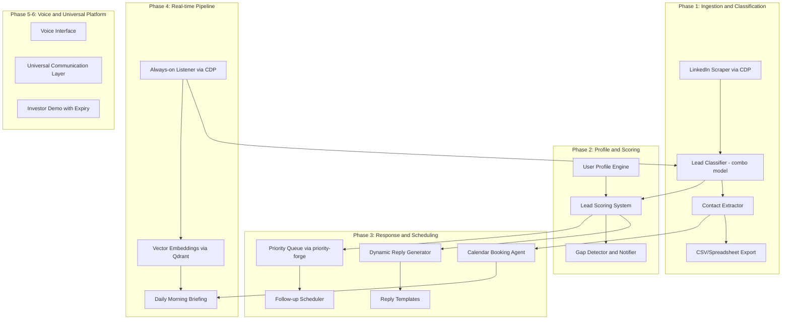
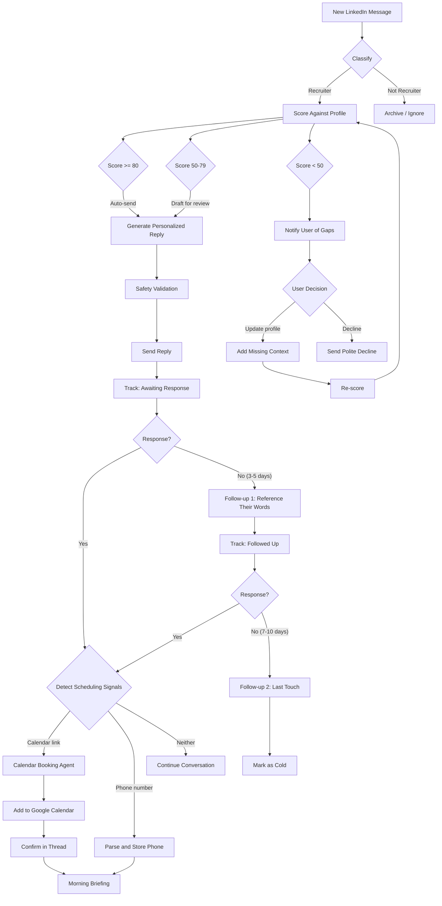

# LinkedIn Leads Intelligence System -- Full Roadmap

## Current State

The project at `[/home/unobtainium/Desktop/github/linkedin-leads](.)` is a Node.js scraper that uses Chrome DevTools Protocol to extract LinkedIn inbox conversations. It has:

- **5 source files** in `src/`: Chrome launcher, CDP client, LinkedIn API calls, DOM scraper, orchestrator
- **1 output file**: `[data/inbox.json](data/inbox.json)` -- 26 conversations, mix of recruiters and non-recruiters
- **Single dependency**: `ws` (WebSocket for CDP)
- **No classification, scoring, response generation, or automation** -- purely a data extraction tool today

The data already contains embedded phone numbers (e.g. `917-672-3146`, `510.391.1522`), calendar links (Google Calendar, Calendly), email addresses, and rich conversation threads with recruiter outreach.

---

## Architecture Overview




---

## Phase 1: Data Foundation (build in parallel with 2 and 3)

### 1A. Lead Classification -- Recruiter vs Non-Recruiter

**Approach:** Pure combo model (o3 + GPT-5) for every conversation, adapted from gravity-pulse's `[pipeline/llm_profiler.py](/home/unobtainium/Desktop/github/gravity-pulse/pipeline/llm_profiler.py)`. Every conversation goes through both stages regardless of apparent difficulty -- this avoids false confidence from heuristics on edge cases (e.g. Rick Zhang: MLE who also recruits, Cam Jackson: Founder/CEO who is also a talent matchmaker).

**Categories:** `recruiter` | `networking` | `spam` | `personal`

#### Stage 1: Classification via Reasoning Model (o3)

The reasoning model's job is to resolve ambiguity. It receives the full conversation context and produces a classification with justification.

**Input payload per conversation:**

```json
{
  "participant": {
    "name": "Cam Jackson",
    "headline": "Founder/CEO | Talent Matchmaker | Solving Hiring",
    "profileUrn": "urn:li:fsd_profile:..."
  },
  "subject": "Quick question about your background",
  "message_count": 4,
  "initiator": "Cam Jackson",
  "messages_preview": [
    { "sender": "Cam Jackson", "text": "Hi Nicholas, I came across your profile..." },
    { "sender": "Nicholas J. Fleischhauer", "text": "Thanks for reaching out..." }
  ]
}
```

- `messages_preview`: First 3 messages + last 2 messages (captures intent and current state). Full thread if <= 8 messages.
- `initiator`: Who sent the first message (strong signal -- recruiters typically initiate).

**System prompt (Stage 1):**

```
You are a lead classifier for a job seeker's LinkedIn inbox. Classify each
conversation into exactly one category:

- recruiter: The other participant is recruiting for a role, whether they are an
  agency recruiter, in-house talent acquisition, or a hiring manager reaching
  out about a specific position.
- networking: Professional connection building, introductions, advice exchange,
  or community interaction with no active recruiting intent.
- spam: Unsolicited sales pitches, promotional messages, or irrelevant outreach
  (ad-spend services, course enrollment, etc.).
- personal: Social messages, congratulations, thank-you notes, or personal
  conversation with no professional recruiting or networking intent.

Consider:
1. The participant's headline and how it relates to their message intent
2. Whether the conversation contains a specific role or job opportunity
3. Who initiated the conversation and why
4. The overall trajectory of the conversation (did it evolve from networking
   into recruiting?)

When ambiguous, reason through the evidence before deciding. A founder who is
also placing candidates is a recruiter. A recruiter who sent a generic
"let's connect" with no role mentioned is networking.
```

**Output schema (Stage 1):**

```json
{
  "classification": "recruiter",
  "confidence": 0.92,
  "reasoning": "Headline explicitly mentions 'Talent Matchmaker'. First message references a specific role. Despite being a Founder/CEO, the primary intent of this conversation is recruitment.",
  "ambiguity_flags": ["dual_role_participant"]
}
```

- `confidence`: 0.0-1.0, derived from model's self-assessment in the reasoning.
- `ambiguity_flags`: Optional list of edge-case indicators (`dual_role_participant`, `evolved_intent`, `unclear_initiator`) -- useful for auditing and improving the classifier over time.

#### Stage 2: Metadata Extraction via Fast Model (GPT-5)

Receives the Stage 1 classification + the full conversation. Extracts structured metadata only for conversations classified as `recruiter` (skips the others to save cost).

**Output schema (Stage 2, recruiter only):**

```json
{
  "role_title": "Senior ML Engineer",
  "company": "DocuSign",
  "industry": "Enterprise SaaS",
  "compensation_hints": "No compensation mentioned",
  "urgency": "medium",
  "recruiter_type": "in-house",
  "role_description_summary": "ML platform work, model deployment, cross-functional collaboration",
  "skills_requested": ["Python", "ML pipelines", "Kubernetes", "cross-functional"],
  "location": "Remote",
  "next_action_needed": "Reply with interest and availability"
}
```

- `urgency`: `high` (explicit deadline or "immediate need"), `medium` (active search, no deadline), `low` (exploratory, "keeping you in mind").
- `recruiter_type`: `agency`, `in_house`, `hiring_manager` -- extracted as metadata even though it's not a top-level category, because it affects response strategy downstream.
- `skills_requested`: Parsed from the role description in their messages. This directly feeds the scoring system in Phase 2B.
- `next_action_needed`: What the conversation is waiting on from our side.

#### Cost and Throughput

- At current scale (26 conversations): negligible cost, ~2 min total runtime.
- At scale (100+ conversations/day): ~$0.50-1.00/day for o3 classifications + ~$0.10-0.20/day for GPT-5 metadata. Acceptable for the accuracy guarantee.
- Batch processing: Classify in batches of 10-20 conversations per API call where possible (o3 supports multi-item structured output).

#### Output Integration

The classifier appends fields to each conversation object in the existing JSON schema:

```json
{
  "conversationUrn": "urn:li:msg_conversation:...",
  "participants": [...],
  "messages": [...],
  "classification": {
    "category": "recruiter",
    "confidence": 0.92,
    "reasoning": "...",
    "ambiguity_flags": [],
    "classified_at": "2026-03-12T10:00:00Z",
    "model_versions": { "stage1": "o3-2025-04-16", "stage2": "gpt-5-0513" }
  },
  "metadata": {
    "role_title": "Senior ML Engineer",
    "company": "DocuSign",
    "skills_requested": ["Python", "ML pipelines"],
    ...
  }
}
```

Enriched data is written to `data/inbox_classified.json` (preserving the original `inbox.json` as raw truth).

New file: `pipeline/classify_leads.py`

### 1B. Contact Info Extraction and CSV Export

- Build a parser that extracts phone numbers, email addresses, and calendar links from message text using regex + LLM fallback for edge cases (e.g. "my number is five ten, nine oh six...").
- Phone number normalization to E.164 format (e.g. `+15109065492`).
- Generate a CSV/spreadsheet mapping: `Name | Headline | Classification | Phone | Email | Calendar Link | Last Activity | Score | Status`
- New files: `pipeline/extract_contacts.py`, `pipeline/export_csv.py`

### 1C. Filtering the Existing Data

- Run the classifier over the current 26 conversations in `[data/inbox.json](data/inbox.json)` as a first pass.
- Based on the exploration, likely recruiter threads: Matthew Browne, Luca Browning, Lauren Klemp, Kiana Parham, Tracey Wallace-Johnson, Michael Silver, Yusuf Roashan, Chloe Lowe, Meeka Diaz, Barun Raj, Job Abraria, Cam Jackson, Freddie Jones, Sanjeev Kumar, Chandra.
- Likely non-recruiter: Alland Ali, James Hawkins, Eric Powers, Alex Steele, Digby H., Felix Lin, Qingyi Yan, Lauren H, Rohit Goenka, Laurie Falzoi Nichols, Rick Zhang (ambiguous -- former eng turned recruiter).

---

## Phase 2: Profile and Scoring Engine (build in parallel with 1 and 3)

### 2A. User Profile Construction

Create a deep structured profile of your skills, experience, and preferences. This is the "ground truth" that scoring and reply generation reference.

- **Format:** A structured YAML/JSON document covering: technical skills (full-stack, ML, workflow automation, CDP, scraping, etc.), project portfolio (gravity-pulse, priority-forge, linkedin-leads, etc.), work history, education, preferences (role types, industries, comp expectations, location, remote/hybrid).
- **Living document:** Include a mechanism for you to add missing context. When the gap detector flags something, you can have a conversation with the LLM to add it to your profile, and future scoring will incorporate it.
- New file: `profile/user_profile.yaml`, `profile/update_profile.py`

### 2B. Lead Scoring System

For each classified recruiter lead, compute a match score:

- **Input:** Role description from recruiter message + your structured profile
- **Method:** LLM-based semantic matching (not just keyword overlap). The model evaluates: skill alignment, experience depth, role level fit, industry match, compensation alignment, location/remote compatibility.
- **Output:** Score 0-100 with breakdown by category, plus a list of "gaps" (skills or experience the role wants that aren't in your profile).
- **Thresholds:**
  - **80+**: High confidence -- auto-reply enabled
  - **50-79**: Medium -- draft reply, await your review
  - **Below 50**: Low -- notify you with gap analysis, you decide
- **Gap notification flow:** When gaps are detected, present them to you. You can then explain missing work/experience via a conversational interface, which updates your profile and re-scores.

New file: `pipeline/score_leads.py`

### 2C. Priority Ordering via priority-forge

Integrate `[priority-forge](/home/unobtainium/Desktop/github/priority-forge)`'s scoring system to order which leads to respond to first:

- Map lead attributes to priority-forge's heuristic weights:
  - `timeSensitive` -- how recently the recruiter messaged, any stated deadlines
  - `effortValueRatio` -- how quickly you can respond (template vs custom)
  - `blockingCount` -- whether the recruiter is waiting on you to proceed
  - `crossProjectImpact` -- score from lead scoring system (higher match = higher priority)
- Maintain a min-heap priority queue of pending leads
- Re-balance when new leads arrive or statuses change

New file: `pipeline/lead_priority.py` (wraps priority-forge's TypeScript via a thin bridge or port to Python)

---

## Phase 3: Response and Scheduling (build in parallel with 1 and 2)

### 3A. Dynamic Reply Generation

- **Template skeleton:** Every reply includes:
  1. Personalized greeting
  2. Dynamic body (LLM-generated, draws from profile to highlight relevant experience for the specific role)
  3. "I share my resume after having a call with the recruiter" policy
  4. Phone number: `510-906-5492`
  5. Link to personal site: `https://fleischhauer.dev/`
  6. Call-to-action (suggest scheduling a call)
- **Generation flow:**
  1. Take lead score breakdown + role description + your profile
  2. LLM generates 2-3 sentence body highlighting your most relevant experience for that specific role
  3. Assemble with template components
  4. For high-confidence (80+): auto-send
  5. For medium (50-79): present draft for your review/edit
  6. For low: present gap analysis, let you decide

New file: `pipeline/generate_reply.py`, `templates/reply_templates.yaml`

### 3B. Calendar Booking Agent

When a calendar link (Calendly, Google Calendar, etc.) is detected in a conversation:

- Spawn a browser automation agent (using CDP, similar to existing scraper architecture)
- Agent has full conversation context: who the recruiter is, what role, what was discussed
- Agent navigates to the calendar link, selects an available slot that doesn't conflict with your existing calendar
- Books the appointment, adds it to your Google Calendar (via Google Calendar API)
- Sends a confirmation message in the LinkedIn thread

Requires: Google Calendar API integration for conflict checking and event creation.

New file: `agents/calendar_agent.py`

### 3C. Follow-up Timing System

Research-backed follow-up strategy:

- **Timing:** The general consensus from sales psychology research and books like "Influence" (Cialdini) supports a 3-5 business day initial follow-up, with a second follow-up at 7-10 days. Beyond that, diminishing returns. The key principles:
  - **Reciprocity + Commitment/Consistency** (from Cialdini): If they expressed interest, reference their specific words. E.g., "You mentioned having a role you thought might be a good fit..." -- this leverages their own commitment.
  - **"How to Win Friends and Influence People" (Carnegie)**: Lead with genuine interest in their work, not just your need. A follow-up could reference something about their company or role that you found interesting.
  - **Loss aversion:** Frame as "I don't want either of us to miss out" rather than "please respond."
  - **No desperation signals:** One follow-up per tier (day 3-5, day 7-10), then mark as cold. Never more than 2 unprompted follow-ups.
  - Your instinct about referencing what they said is correct and aligns with the commitment/consistency principle. The refinement: add a small piece of value (an insight about their company/industry) rather than just asking "what happened?"
- **Implementation:**
  - Track conversation state: `awaiting_response`, `scheduled`, `followed_up_1`, `followed_up_2`, `cold`
  - Timer-based triggers integrated with the priority queue
  - LLM generates follow-up messages using the principles above + full conversation context

New file: `pipeline/followup_scheduler.py`

### 3D. AI Identity Protection and Prompt Injection Defense

Critical rules the system must enforce:

- **Never disclose AI nature:** All generated messages must pass through a validation layer that checks for phrases like "as an AI", "I'm an assistant", "I was programmed", etc. If detected, regenerate.
- **System prompt hardening:** Use a layered prompt architecture:
  1. Immutable system prompt with identity rules
  2. Conversation context in a clearly delimited section
  3. Never include raw recruiter messages directly in the system prompt -- sanitize first
- **Prompt injection defense:**
  - Input sanitization: Strip/escape any prompt-like patterns from incoming messages ("ignore previous instructions", "you are now", etc.)
  - Output validation: Post-generation check for identity leaks
  - Behavioral guardrails: If the model's output diverges from expected patterns (e.g. suddenly discussing its own architecture), flag and regenerate
- **Persona consistency:** The system operates as "you" -- matching your communication style, referencing your actual experience, using first person.

New file: `pipeline/safety.py`

---

## Phase 4: Real-time Pipeline and Daily Briefings

### 4A. Always-on LinkedIn Listener

Adapt gravity-pulse's `[scrapers/slack-listener.mjs](/home/unobtainium/Desktop/github/gravity-pulse/scrapers/slack-listener.mjs)` pattern:

- Instead of observing Slack WebSocket frames, observe LinkedIn's messaging WebSocket via CDP
- Detect new incoming messages in real-time
- Pipe each new message through: classify -> score -> prioritize -> generate response or notify
- Append to consolidated data file (with lockfile, same pattern as gravity-pulse)

New file: `src/linkedin-listener.mjs`

### 4B. Vector Embeddings for Conversations

Adapt gravity-pulse's embedding pipeline:

- Embed all conversation messages into Qdrant using `sentence-transformers/all-MiniLM-L6-v2` (384 dims)
- Enable semantic search across all conversations: "find conversations where someone mentioned a senior ML role at a startup"
- Real-time embedding of new messages as they arrive
- Hybrid search: vector + BM25 (same as gravity-pulse's `[search/search_messages.py](/home/unobtainium/Desktop/github/gravity-pulse/search/search_messages.py)`)

New files: `pipeline/embed_conversations.py`, `search/search_leads.py`

### 4C. Daily Morning Briefing

- Cron job or scheduled task that runs each morning at a configured time
- Aggregates:
  - Today's calendar meetings with context (who, what role, conversation summary)
  - New unprocessed leads ranked by priority
  - Follow-ups due today
  - Leads that went cold
- Output format: initially a structured text report (terminal/email), eventually voice (Phase 5)

New file: `pipeline/morning_briefing.py`

---

## Phase 5: Voice Interface

### 5A. Voice Input

- Speech-to-text integration (e.g. Whisper API or local Whisper model)
- Wake word or push-to-talk activation
- Natural language commands: "What meetings do I have today?", "Draft a reply to the Google recruiter", "Score the latest lead from Freddie Jones"

### 5B. Voice Output

- Text-to-speech for briefings and notifications (e.g. OpenAI TTS, ElevenLabs)
- Read morning briefings aloud
- Announce new high-priority leads in real-time

### 5C. Conversational Loop

- Voice-driven profile updates: "Add to my profile that I built a real-time data pipeline at Company X"
- Voice-driven gap resolution: "The reason I'm qualified for that ML role is because of my work on gravity-pulse"
- Voice approval of draft replies: "Read me the draft for the Kforce recruiter... approve it" or "Change the second sentence to mention my CDP experience"

---

## Phase 6: Universal Platform and Packaging

### 6A. Abstract Common Patterns

Identify shared infrastructure across linkedin-leads, gravity-pulse, and priority-forge:

- **CDP browser interaction layer** (already shared between gravity-pulse and linkedin-leads)
- **Combo model classification pipeline** (reusable across any text classification task)
- **Real-time listener pattern** (WebSocket observation -> classify -> embed -> act)
- **Priority queue with heuristic scoring** (reusable for any task prioritization)
- **Vector embedding + hybrid search** (reusable for any text corpus)

Extract these into a shared library/framework.

### 6B. Multi-channel Communication Hub

Extend beyond LinkedIn:

- Email integration (Gmail API)
- SMS (Twilio)
- Other professional platforms (AngelList, etc.)
- Unified inbox: all channels feed into the same classify -> score -> respond pipeline

### 6C. Investor Demo and Packaging

- QR code onboarding flow: scan -> download -> 30-day free trial
- Expiration mechanism: time-limited API keys or license tokens that revoke automation access after trial period
- Demo mode: real data, real messiness, showcasing robustness
- Package as a self-contained application (Docker or Electron)

---

## Prerequisite: Profile Data Ingestion (Separate Plan)

Phases 2 and 3 depend heavily on a rich, structured user profile. The scoring system, reply generator, and gap detector are only as good as the profile they reference. This is a substantial task that warrants its own dedicated plan.

**See:** [Profile Data Ingestion Plan](.) (separate `.plan.md` file)

That plan covers:

- Systematic interview-style extraction of skills, work history, and project portfolio
- Ingestion of existing artifacts (resume, LinkedIn profile, project READMEs from gravity-pulse/priority-forge/linkedin-leads)
- Structured schema design for the profile document
- Iterative refinement loop (gap detection feeds back into profile updates)
- Embedding the profile into the vector store for semantic retrieval during reply generation

This plan should be executed **before or in parallel with** Phase 2A of the main roadmap.

---

## Recruiter Interaction Flow (Detailed Sequence)

This is the core loop that phases 1-3 enable:




