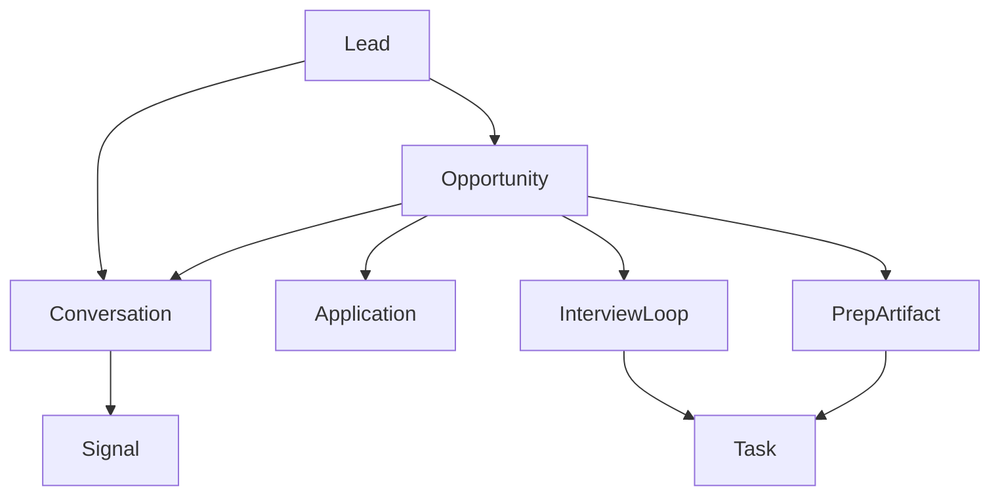
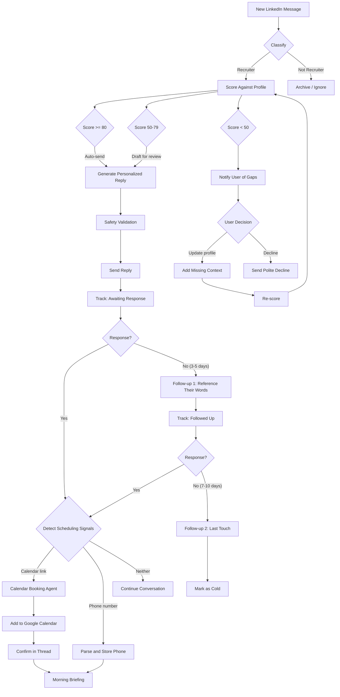

# LinkedIn Leads — Intelligent Lead Management System

An end-to-end system for scraping, classifying, scoring, and responding to LinkedIn recruiter messages. Starts with CDP-based inbox scraping and layers on LLM classification, profile-aware lead scoring, dynamic reply generation, follow-up scheduling, and a unified review UI for replies plus canonical workflow state.

> **Install:** this app runs on a Linux VPS you bring (any provider —
> Hetzner / DigitalOcean / Vultr / Lightsail / GCP / Linode). One-shot
> setup from the monorepo root: `./setup-server.sh` (preflight-checks
> resources, generates `.env`, brings up the docker compose stack with
> noVNC desktop, installs host crons). See [the monorepo README](../../README.md#inbound-your-vps--linkedin-leads-docker-stack)
> for the full install path.

## Unified Hunt Direction

`linkedin-leads` is now the core of a broader job-hunt operating system, not just a recruiter inbox tool.

The consolidation direction is:

- keep `linkedin-leads` as the operational core
- absorb systems design prep, company prep, flashcards, and debriefs as structured knowledge
- expand from recruiter conversations into opportunities, applications, interview loops, and tasks
- treat old projects like `career-deer-product` as product reference material, not code to merge directly

The full architecture and migration plan live here:

- `docs/UNIFIED_HUNT_ARCHITECTURE.md`
- `docs/CONSOLIDATION_PLAN.md`
- `schemas/README.md`
- `prep/README.md`

Manual canonical corrections that should survive sync reruns live in `data/entities/overrides.json`.

### Canonical Entity Model

- `Lead`: a recruiter, hiring manager, founder, referrer, or other hiring contact
- `Opportunity`: a role and company combination
- `Conversation`: a communication thread tied to leads and an opportunity
- `Application`: an outbound application record regardless of source
- `InterviewLoop`: interview rounds, scheduling, outcomes, and debriefs
- `PrepArtifact`: company notes, systems design topics, flashcards, resume variants, and debriefs
- `Task`: follow-up, study, application, and prep work generated by the system
- `Signal`: extracted structured hints such as deadlines, urgency, phone numbers, and skill gaps

### How The Pieces Merge

- Recruiter messages create or update `Lead`, `Opportunity`, and `Conversation`
- Scoring determines whether to reply, follow up, archive, or prep
- Interview signals should attach a prep packet composed of company notes, systems design topics, flashcards, and tailored talking points from the profile
- The morning briefing should evolve into `today's hunt`, covering leads, applications, interviews, prep tasks, company notes, and study blocks
- Post-interview debriefs should update both the opportunity record and the prep knowledge layer

### Data Flow

The clean mental model is:

1. CDP + LinkedIn API/DOM gets the raw inbox data deterministically.
2. LLM pipeline annotates that raw data.
3. canonical sync builds normalized entities from raw + annotations + local state.
4. prep/review/briefing consumes the canonical layer.

Optional enrichment fits beside that deterministic path:

5. external company research can be queued separately, parsed into draft `PrepArtifact`s, and only affects prep after explicit apply.

### Embeddings Intent

Vector embeddings serve three distinct purposes in this system:

1. semantic search across recruiter conversations via `npm run search`
2. listener freshness, where new messages can be embedded as they arrive so search/briefing stay current
3. retrieval-augmented reply generation, where `generate_reply.py` can pull the most relevant profile chunks and similar recruiter-message snippets before drafting a response

That means embeddings are no longer just a standalone search sidecar. They are part of the reply-generation path as well.

### Visual Map



For the full mapper diagrams, see `docs/UNIFIED_HUNT_ARCHITECTURE.md`.

## Recruiter Interaction Flow



## Prerequisites

- **Node.js** v18+
- **Python** 3.12+
- **Google Chrome** installed
- **LinkedIn account** logged in via Chrome
- **OpenAI API key** (for classification, scoring, reply generation)

## Setup

```bash
cd linkedin-leads
npm install
pip install -r requirements.txt
cp .env.example .env  # add your OPENAI_API_KEY
```

## Usage

### 1. Launch Chrome with CDP enabled

```bash
npm run launch-chrome
```

This opens Chrome with `--remote-debugging-port=9222` and a persistent profile at `~/.linkedin-cdp-chrome-profile`. On first run, log into LinkedIn in the browser window that opens. Your session persists across restarts.

Options:
```bash
node src/launch-chrome.mjs --port 9333   # use a different CDP port
```

### 2. Scrape your inbox

```bash
npm run inbox
```

This scrapes all conversations from the last 14 days with complete message history and saves to `data/inbox.json`.

Options:
```bash
node src/scrape-inbox.mjs --days 30          # last 30 days instead of 14
node src/scrape-inbox.mjs --count 50         # cap at 50 conversations
node src/scrape-inbox.mjs --thread "Matthew" # re-scrape only matching thread(s), merge into existing data
```

The `--thread` flag is useful for updating a single conversation without re-scraping everything. It matches against participant names (case-insensitive) and merges the fresh data into the existing `data/inbox.json`.

## How It Works

The scraper operates in two phases:

### Phase 1: Conversation Discovery (GraphQL API)

Fetches the conversation list via LinkedIn's Voyager MessagingGraphQL endpoint, which runs as `fetch()` inside the authenticated browser tab through CDP `Runtime.evaluate`. This gives us:

- Conversation URNs (thread identifiers)
- Participant names, profile URNs, headlines
- Metadata (timestamps, read status, unread count)
- Cursor-based pagination to retrieve all conversations within the time window

### Phase 2: Message Extraction (DOM Scraping)

LinkedIn's API hard-caps messages at ~20 per conversation. To get the full history, the scraper:

1. **Navigates** to each conversation's thread URL (`/messaging/thread/{id}/`) via CDP `Page.navigate`
2. **Scrolls up** using CDP `Input.dispatchMouseEvent` with `mouseWheel` type — this is required because LinkedIn's React components only lazy-load older messages in response to real input events, not programmatic `scrollTop` changes
3. **Stabilizes** by repeating scroll events until the message count stops increasing (8 consecutive stable rounds at 1.2s intervals)
4. **Extracts** all messages from the DOM: sender name, body text, subject line (for InMails), and timestamps
5. **Resolves timestamps** from relative date headings ("Today", "Friday", "Mar 5") into full ISO-8601 dates

If DOM scraping fails for any conversation, it falls back to the GraphQL API (capped at 20 messages but better than nothing).

## Output Format

`data/inbox.json`:

```json
{
  "scrapedAt": "2026-03-12T19:40:16.685Z",
  "lookbackDays": 14,
  "cutoffDate": "2026-02-26T...",
  "conversationCount": 26,
  "conversations": [
    {
      "conversationUrn": "urn:li:msg_conversation:(...)",
      "participants": [
        {
          "name": "Matthew Browne",
          "profileUrn": "urn:li:fsd_profile:ACoAA...",
          "headline": "Division Manager at Strategic Employment Partners"
        }
      ],
      "lastActivityAt": "2026-03-12T17:09:52.969Z",
      "createdAt": "2026-03-05T20:30:03.730Z",
      "unreadCount": 0,
      "read": true,
      "messages": [
        {
          "sender": "Matthew Browne",
          "text": "Hi Nicholas J., I am currently working with...",
          "subject": "Software Engineer Applied AI - $500k",
          "timestamp": "2026-03-05T20:30:00.000Z"
        }
      ]
    }
  ]
}
```

Each conversation includes all participants, API metadata, and a chronologically-ordered messages array extracted from the DOM.

## Core Pipeline

The entire system boils down to four steps:

```
npm run pipeline
```

```
  classify  →  embed  →  score  →  reply  →  export
     │           │         │         │          │
   "Is this    Store in   "How     Generate   Write to
  a recruiter  Qdrant for  good a  a reply    CSV
  or spam?"    search      fit?"   draft
```

That's it. One command. Raw inbox messages go in, scored reply drafts and a CSV come out.

Each step is also runnable individually:

| Step | Command | What it does |
|------|---------|--------------|
| 1 | `npm run classify` | LLM classifies each conversation as recruiter / networking / spam / personal |
| 2 | `npm run embed` | Embeds messages into Qdrant for semantic search and downstream retrieval |
| 3 | `npm run score` | Scores recruiter leads 0-100 against your profile |
| 4 | `npm run replies` | Generates personalized reply drafts with safety validation |
| 5 | `npm run export-csv` | Exports contacts to `data/contacts.csv` |

## All Commands

| Command | Description |
|---------|-------------|
| `npm run launch-chrome` | Open Chrome with CDP debugging port |
| `npm run inbox` | Scrape LinkedIn inbox to `data/inbox.json` |
| `npm run classify` | Classify conversations (recruiter vs. non-recruiter) |
| `npm run score` | Score recruiter leads against your profile |
| `npm run replies` | Generate personalized reply drafts |
| `npm run review` | Launch the unified review UI for reply drafts, applications, interviews, and canonical task state |
| `npm run extract` | Extract phone numbers, emails, calendar links |
| `npm run export-csv` | Export contacts to `data/contacts.csv` |
| `npm run priority` | Run priority-forge scoring on leads |
| `npm run followups` | Check and generate canonical follow-up drafts from entity records |
| `npm run followups:check` | Show which canonical follow-ups are currently due |
| `npm run followups:mark-sent -- TASK_ID` | Promote a drafted follow-up into sent workflow state |
| `npm run workflow -- <subcommand>` | Persist application and interview state changes that must survive resyncs |
| `npm run briefing` | Generate the canonical today's-hunt briefing |
| `npm run sync:entities` | Map current pipeline output into canonical hunt entity records |
| `npm run briefing:hunt` | Generate a canonical today's-hunt briefing from entity records |
| `npm run review:ambiguities` | List opportunities still using placeholder company/role values |
| `npm run embed` | Embed conversations into Qdrant |
| `npm run embed:profile` | Embed user profile into Qdrant |
| `npm run search` | Run hybrid search over embedded conversations |
| `npm run pipeline` | Run full pipeline (classify → embed → score → reply → export) |

Reply generation now uses bounded retrieval from Qdrant when available:

- profile chunks come from the `user_profile` collection
- similar recruiter-message snippets come from the embedded conversation collection
- both are trimmed and treated as optional context, not hard requirements

## Architecture

Canonical follow-up workflow:
- `npm run followups` writes draft follow-ups to `data/entities/followups.json` without advancing live state.
- `npm run followups:mark-sent -- TASK_ID` marks a draft as sent, records `last_outbound_at` in `data/lead_states.json`, and allows future resyncs to preserve follow-up state.

Canonical application/interview workflow:
- `npm run workflow -- show` prints the durable overlay at `data/entities/workflow_state.json`.
- `npm run workflow -- list-applications --query Apple` lists application IDs with company and role context.
- `npm run workflow -- list-interviews --query Apple` lists interview loop and stage IDs with company and role context.
- `npm run workflow -- list-tasks --query Apple` lists canonical workflow tasks with company and role context.
- `npm run workflow -- lookup Apple` searches both application and interview workflow targets at once.
- `npm run workflow -- set-application-status --query Apple interviewing` resolves a unique target directly from company or role text.
- `npm run workflow -- set-interview-stage --query Apple scheduled --scheduled-at 2026-04-15T17:00:00+00:00` resolves a unique loop and single stage directly from query text.
- `npm run workflow -- add-interview-stage --query Apple technical --after-stage-id STAGE_ID` appends an additional canonical interview stage that survives resyncs.
- `npm run workflow -- set-task-status --query "Prepare for interview: Full Stack ML Engineer at Apple" in_progress` persists canonical task lifecycle changes.
- `npm run workflow -- mark-application-submitted APP_ID --application-url URL` records an application submission in durable state.
- `npm run workflow -- set-interview-stage LOOP_ID STAGE_ID scheduled --scheduled-at 2026-04-15T17:00:00+00:00` records a scheduled interview stage.
- `npm run workflow -- set-interview-stage LOOP_ID STAGE_ID completed --debrief "..."` records a completed interview and debrief.
- Stage-aware task generation now creates prep, systems-design study, and debrief tasks per interview stage, and writes those task links back onto the canonical interview loop.
- Stage-aware prep packets are now synthesized locally from linked prep artifacts plus profile context and surfaced in both `npm run review` and `npm run briefing:hunt`.
- `PrepArtifact` records now carry normalized `structured_data` for company dossiers and systems-design topics, so prep packet synthesis is no longer scraping markdown headings on every read.
- External company research can now be queued via `npm run research:enrich`, stored under `data/knowledge/company_research/`, and parsed into draft `company_dossier` artifacts that remain inert until explicitly applied.
- Applied research artifacts are ingested by canonical sync like any other prep artifact, but draft research artifacts are kept separate so they do not silently overwrite the local baseline.

### External Research Enrichment

The baseline prep system is still local and deterministic. External research is an optional side lane:

- queue a job: `npm run research:enrich -- queue --opportunity-id OPP_ID`
- semi-auto queue/start in bounded batches: `npm run research:enrich -- auto --limit 3`
- inspect jobs: `npm run research:enrich -- list`
- submit queued jobs to Gemini: `npm run research:enrich -- start`
- poll completed jobs: `npm run research:enrich -- poll`
- manually ingest a markdown report: `npm run research:enrich -- ingest-report --job-id JOB_ID --report-file /path/to/report.md`
- activate a parsed research artifact: `npm run research:enrich -- apply --job-id JOB_ID`

Research reports land in `data/knowledge/company_research/` as:

- raw markdown reports
- parsed draft artifact JSON files

Those parsed artifacts stay `draft` until explicitly applied. Canonical sync ingests them either way for visibility, but only `active` or `reviewed` prep artifacts are attached to opportunities and interview stages.

The `auto` command is the semi-automatic path:

- it scans canonical opportunities in `interviewing` state by default
- it queues missing external research jobs in a bounded batch
- if `GEMINI_API_KEY` is configured, it immediately submits those queued jobs
- it still does **not** auto-apply returned artifacts

Use `--include-contacted` if you also want to research earlier-stage opportunities.

The review UI now surfaces external research jobs inside the `Workflow` tab:

- inspect queued, submitted, completed, and applied research jobs
- view parsed artifact summaries and source lists
- start or poll a specific job
- apply a completed draft artifact without using the CLI
- Stage-level prep matching now uses that structured metadata, so recruiter screens, system-design rounds, and later-stage interviews can attach different prep inputs from the same canonical artifact pool.
- `npm run review` now exposes all interview stages inside each loop card, lets you add new stages, and lets you update canonical task state from the same review surface.

```
linkedin-leads/
├── src/                        # Node.js — CDP scraping layer
│   ├── launch-chrome.mjs       # launches Chrome with CDP debugging port
│   ├── cdp-client.mjs          # CDP WebSocket connection + JS evaluation
│   ├── linkedin-api.mjs        # GraphQL API fetch expression builders
│   ├── dom-scraper.mjs         # DOM navigation, scrolling, message extraction
│   ├── scrape-inbox.mjs        # main orchestrator
│   └── linkedin-listener.mjs   # always-on CDP WebSocket observer
│
├── pipeline/                   # Python — intelligence layer
│   ├── config.py               # centralized configuration
│   ├── classify_leads.py       # two-stage LLM classifier (Pydantic + .parse())
│   ├── score_leads.py          # LLM-based lead scoring (0-100) vs. profile
│   ├── generate_reply.py       # dynamic reply generation with safety validation
│   ├── extract_contacts.py     # phone/email/calendar link extraction
│   ├── export_csv.py           # CSV export
│   ├── hunt_briefing.py        # today's-hunt briefing from canonical entity records
│   ├── sync_entities.py        # canonical entity sync for the unified hunt model
│   ├── lead_priority.py        # priority-forge weighted heuristic scoring
│   ├── followup_scheduler.py   # research-backed follow-up timing
│   ├── morning_briefing.py     # compatibility wrapper over the canonical hunt briefing
│   ├── embed_conversations.py  # Qdrant vector embedding
│   ├── voice_interface.py      # STT/TTS voice interaction
│   ├── safety.py               # AI identity protection + prompt injection defense
│   └── review_server.py        # unified review UI for replies, multi-stage interviews, and workflow/task state
│
├── profile/                    # user profile data layer
│   ├── user_profile.yaml       # structured professional profile
│   ├── ingest_repos.py         # LLM-powered repo analyzer
│   ├── interview.py            # guided CLI for preferences/goals
│   ├── merge_profile.py        # multi-source profile merger
│   └── update_profile.py       # CLI for profile updates
│
├── templates/
│   └── reply_templates.yaml    # reply template structure per confidence tier
│
├── search/
│   └── search_leads.py         # hybrid search (Qdrant + BM25 + RRF)
│
├── agents/
│   └── calendar_agent.py       # Google Calendar booking agent
│
├── docs/                       # architecture and migration docs for the unified hunt system
│   ├── UNIFIED_HUNT_ARCHITECTURE.md
│   └── CONSOLIDATION_PLAN.md
│
├── lib/                        # reusable abstractions
│   ├── combo_classifier.py     # generic two-stage LLM classification
│   ├── realtime_listener.py    # generic CDP WebSocket observer
│   ├── priority_queue.py       # generic min-heap priority queue
│   ├── channel_hub.py          # multi-channel communication hub
│   └── trial_manager.py        # time-limited trial token system
│
├── prep/                       # structured interview-prep and knowledge artifacts
│   ├── companies/              # company dossiers and interview packets
│   ├── topics/                 # reusable topic prep such as systems design
│   ├── flashcards/             # curated flashcard sets
│   └── debriefs/               # post-interview notes and lessons learned
│
├── schemas/                    # canonical JSON schemas for unified hunt entities
│   ├── lead.schema.json
│   ├── opportunity.schema.json
│   ├── conversation.schema.json
│   ├── application.schema.json
│   ├── interview-loop.schema.json
│   ├── prep-artifact.schema.json
│   ├── task.schema.json
│   └── signal.schema.json
│
└── data/
    ├── inbox.json              # raw scraped conversations
    ├── inbox_classified.json   # classified + scored + reply drafts
    ├── contacts.csv            # exported contact spreadsheet
    ├── entities/               # canonical entity storage landing zone
    └── knowledge/              # normalized machine-friendly knowledge
```

### Module Responsibilities

| Module | Purpose |
|--------|---------|
| `cdp-client.mjs` | Connects to Chrome via `localhost:9222/json`, opens WebSocket to the LinkedIn tab, provides `evaluate()` for running JS in the browser context, extracts CSRF token from `JSESSIONID` cookie |
| `linkedin-api.mjs` | Builds `fetch()` expressions for LinkedIn's Voyager MessagingGraphQL API. Handles LinkedIn's proprietary URL encoding for URNs in query variables. Exports `fetchConversations()`, `fetchMessages()`, `fetchCurrentProfile()` |
| `dom-scraper.mjs` | Navigates to thread URLs via CDP `Page.navigate`, scrolls using `Input.dispatchMouseEvent` mouseWheel events, extracts messages from `ul.msg-s-message-list-content > li` elements, resolves relative date headings ("Friday", "Today") to ISO timestamps |
| `scrape-inbox.mjs` | Orchestrates the full pipeline: connect to Chrome → discover conversations via API → scrape messages via DOM → API fallback for failures → merge/write JSON |

### Data Flow

```
Chrome (linkedin.com, logged in)
  ↑ CDP WebSocket (port 9222)
  |
cdp-client.mjs ←── connectToLinkedIn(), evaluate(), getCSRFToken()
  |
  ├── linkedin-api.mjs ←── fetchConversations() with cursor pagination
  |     (runs fetch() inside browser, returns GraphQL JSON)
  |
  └── dom-scraper.mjs ←── Page.navigate → mouseWheel scroll → DOM extraction
        (navigates to each /messaging/thread/ID/, scrolls to top, reads DOM)
  |
scrape-inbox.mjs ←── orchestrates both, writes data/inbox.json
```

## Reliability Features

- **Per-conversation error isolation** — one failed thread retries once, then moves on without killing the run
- **CDP timeout handling** — mouseWheel dispatch timeouts are caught and treated as non-fatal (the page may be busy rendering)
- **API fallback** — conversations where DOM scraping yields <= 1 message automatically fall back to the GraphQL API (capped at 20 messages)
- **Graceful connection failure** — clear error message with instructions if Chrome isn't running
- **Sequential CDP message IDs** — deterministic counter instead of `Math.random()`, eliminating collision risk on rapid WebSocket calls
- **Safe cleanup** — `cdp.close()` wrapped in try/catch in the finally block

## Key Technical Details

### Why mouseWheel instead of scrollTop?

LinkedIn's messaging UI is a React app with virtualized scrolling. Setting `container.scrollTop = 0` or dispatching JavaScript `scroll`/`wheel` events does **not** trigger the lazy-load handlers that fetch older messages. Only CDP-level `Input.dispatchMouseEvent` with `type: 'mouseWheel'` simulates a real user scroll that React's event system responds to.

### Why Page.navigate instead of window.location?

Setting `window.location.href` inside a CDP `Runtime.evaluate` call destroys the JavaScript execution context before the async promise can resolve, causing an "Execution context was destroyed" error. CDP's `Page.navigate` command navigates at the protocol level without this issue.

### Profile URN namespace conversion

LinkedIn's `/me` endpoint returns URNs in the `fs_miniProfile` namespace (`urn:li:fs_miniProfile:ACoAA...`) but the messaging API requires the `fsd_profile` namespace (`urn:li:fsd_profile:ACoAA...`). The scraper extracts the ID and reconstructs the URN. The underlying ID is the same — only the namespace differs.

### GraphQL query IDs

LinkedIn's MessagingGraphQL endpoint uses hardcoded query IDs that may change with LinkedIn deployments:

| Query | ID |
|-------|-----|
| Conversations | `messengerConversations.9501074288a12f3ae9e3c7ea243bccbf` |
| Messages | `messengerMessages.5846eeb71c981f11e0134cb6626cc314` |

**If these break** (you'll see HTTP 400/500 errors during conversation discovery), open Chrome DevTools on the LinkedIn messaging page, go to the Network tab, filter for `voyagerMessagingGraphQL`, and look at the `queryId` parameter in recent requests to find the current IDs. Update them in `src/linkedin-api.mjs`.

### DOM selectors used

| Element | Selector |
|---------|----------|
| Message list container | `div.msg-s-message-list` |
| Message list UL | `ul.msg-s-message-list-content` |
| Message items | `li.msg-s-message-list__event` |
| Sender name | `.msg-s-message-group__name` |
| Message body | `.msg-s-event-listitem__body` |
| Timestamp | `time.msg-s-message-group__timestamp` |
| Date heading | `time.msg-s-message-list__time-heading` |
| Subject (InMail) | `h3.msg-s-event-listitem__subject` |

If LinkedIn redesigns their messaging UI, these selectors will need updating. Inspect the DOM in Chrome DevTools to find the new class names.

## Troubleshooting

| Problem | Fix |
|---------|-----|
| `Could not connect to Chrome` | Run `npm run launch-chrome` first |
| `No LinkedIn tab found` | Make sure linkedin.com is open in the CDP-launched Chrome window |
| `Could not extract CSRF token` | Log into LinkedIn in the Chrome window |
| `Could not determine your profile URN` | LinkedIn session expired — log in again |
| `API error 429` | Rate limited — wait a few minutes and retry |
| Messages capped at 20 for a thread | Ensure the Chrome window is **not minimized** — viewport must be visible for mouseWheel events to trigger scroll rendering |
| `queryId` returns 400/500 errors | LinkedIn changed their GraphQL query IDs — see [GraphQL query IDs](#graphql-query-ids) above |
| Timestamps show only dates, no times | Some messages lack a per-message timestamp element; the date from the heading is used as a fallback |

## Environment Variables

| Variable | Default | Purpose |
|----------|---------|---------|
| `CDP_PORT` | `9222` | Chrome DevTools Protocol port |
| `CHROME_BIN` | *(auto-detected)* | Path to Chrome binary |

## Origin

The CDP connection layer (`cdp-client.mjs`, `launch-chrome.mjs`) was extracted and adapted from the [gravity-pulse](https://github.com/) project's browser interaction system. The LinkedIn API helpers and DOM scraping logic are purpose-built for this tool.
