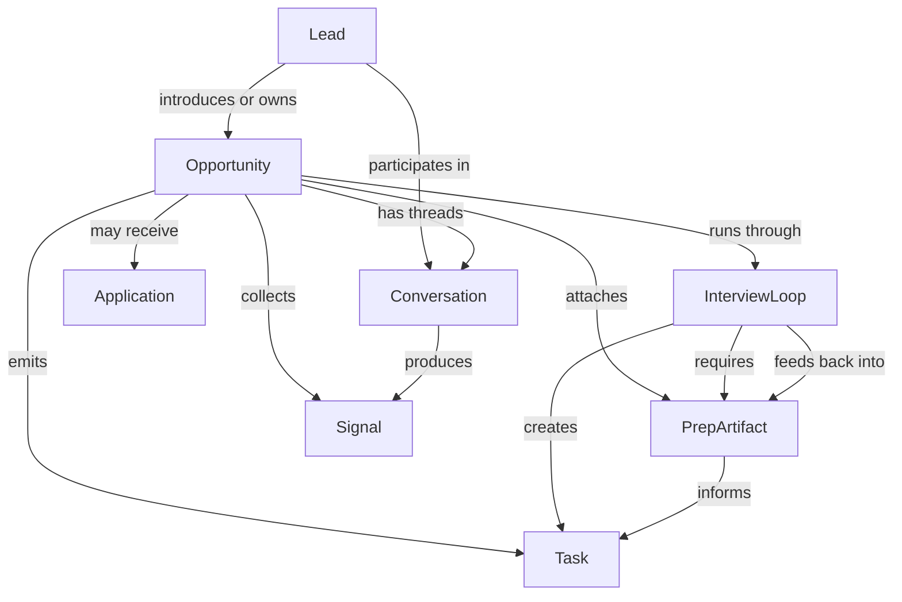
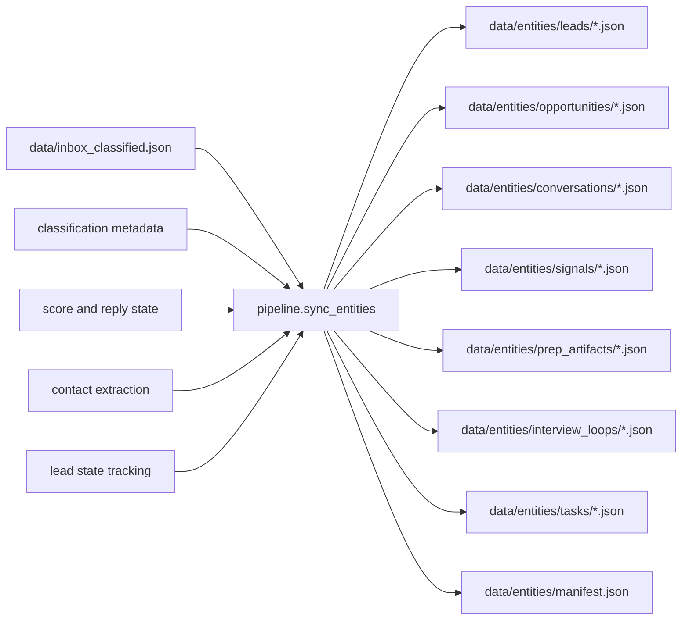
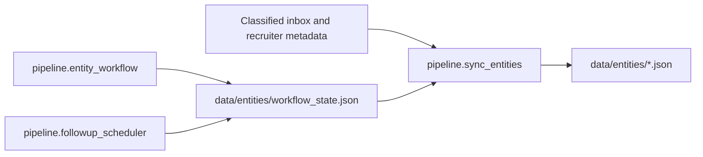
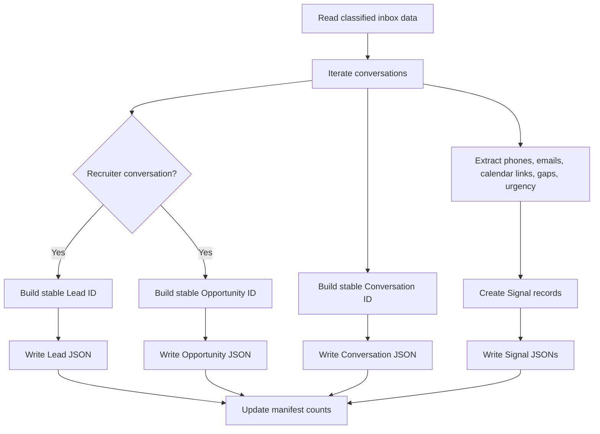

# Unified Hunt Architecture

`linkedin-leads` is evolving from a LinkedIn recruiter pipeline into a broader job-hunt operating system.

The goal is to consolidate recruiter outreach, applications, interview prep, follow-ups, and personal knowledge artifacts into one coherent system instead of maintaining separate folders and experiments across the Desktop.

## Core Direction

`linkedin-leads` remains the operational core because it already has working ingestion, classification, scoring, reply generation, follow-up scheduling, search, profile awareness, and daily briefing primitives.

Other projects and folders should be absorbed by role:

- `career-deer-product`: product vision and future UX reference
- `systems-design-practice`: systems design prep knowledge source
- `vy-prep`: company-specific interview prep dossiers
- `job-hunt`: personal notes and administrative tracking
- `task-system-interview`: reusable prioritization ideas, not product surface area

## Canonical Entity Model

- `Lead`: a recruiter, hiring manager, founder, referrer, or other hiring contact
- `Opportunity`: a role-company combination with an evolving stage and fit signal
- `Conversation`: a communication thread tied to one or more leads and an opportunity
- `Application`: an outbound application record regardless of source platform
- `InterviewLoop`: all interview stages, events, outcomes, and debriefs for an opportunity
- `PrepArtifact`: knowledge objects such as company notes, system design topics, flashcards, behavioral stories, and resume variants
- `Task`: an action item generated from recruiting, interviewing, studying, scheduling, or manual planning
- `Signal`: extracted structured hints such as deadlines, phone numbers, calendar links, urgency, or skill gaps

## Entity Map



## How The Pieces Merge

- Recruiter messages in `linkedin-leads` create or update `Lead`, `Opportunity`, and `Conversation`
- Scoring logic determines whether to reply, follow up, archive, or prep
- If an interview signal is detected, the system should automatically attach a prep packet:
  - company dossier from `vy-prep` style notes
  - systems design topics from `systems-design-practice`
  - flashcards from interview-flashcard assets
  - tailored talking points based on `profile/user_profile.yaml`
- The morning briefing should expand from lead triage into `today's hunt`:
  - top leads
  - applications needing action
  - interviews coming up
  - prep tasks due today
  - company-specific notes
  - systems design study block
- After each interview, debrief notes should update both the `Opportunity` record and the prep knowledge layer

## Current Entity Sync Flow

The current mapper is the first bridge from the existing recruiter pipeline into the canonical entity model.



## Durable Workflow Overlay

Canonical records are regenerated. Operational actions that must survive regeneration live in a separate workflow overlay.



- `workflow_state.json` stores durable application, interview, and task state changes
- `sync_entities` projects that overlay back into canonical `Application`, `InterviewLoop`, `Task`, and `Opportunity` records
- overlay stage definitions let interview loops grow beyond the single inferred base stage without losing those additions on resync
- canonical tasks can be marked `in_progress`, `waiting`, `complete`, or `cancelled` and those lifecycle changes survive regeneration
- stage-aware task generation links prep and debrief work back onto each interview stage through `stage.task_ids`
- deterministic prep packets synthesize company dossiers, systems-design topics, flashcards, and profile highlights into stage-specific interview context for the review UI and hunt briefing
- prep artifacts now store normalized `structured_data` for dossier/topic fields such as interview angles, tailored value props, primary topics, and stage tags, reducing dependence on markdown parsing heuristics at read time
- stage matching now uses those normalized tags to decide which artifacts belong on recruiter screens versus system-design or later-stage interviews
- optional external company-research jobs can produce draft `company_dossier` artifacts under `data/knowledge/company_research/`, but those drafts remain inert until explicitly applied
- `followup_scheduler` still owns recruiter-thread follow-up state and queue state

## Optional External Enrichment Lane

The deterministic four-step data flow remains the backbone:

1. CDP + LinkedIn API/DOM gets the raw inbox data deterministically.
2. LLM pipeline annotates that raw data.
3. canonical sync builds normalized entities from raw + annotations + local state.
4. prep/review/briefing consumes the canonical layer.

External company research is an optional fifth lane, not a replacement:

- queue research from an `Opportunity` or explicit company/role context
- optionally run a bounded semi-automatic queue/start pass over active opportunities
- submit async provider jobs
- store the raw report separately
- parse the report into a narrow draft `PrepArtifact`
- explicitly apply the artifact before it can affect stage prep matching
- expose those draft/completed research jobs in the workflow review UI so approval can happen without dropping to the CLI

## Embeddings Architecture

Embeddings were originally intended for more than standalone search. The current intended shape is:

1. semantic search over recruiter conversations
2. listener-driven freshness, where newly observed messages can be embedded immediately
3. profile-aware and history-aware reply generation via bounded retrieval

In concrete terms:

- `embed_conversations.py` writes recruiter-message vectors plus metadata into Qdrant
- `embed_profile.py` writes semantically meaningful profile chunks into the `user_profile` collection
- `search/search_leads.py` exposes hybrid conversation retrieval and profile retrieval
- `generate_reply.py` now consumes both:
  - top profile chunks relevant to the recruiter's role/message
  - a small number of similar recruiter-message snippets from prior conversations

This keeps the prompt bounded while letting reply drafting answer the higher-value question:

`What from my background is most relevant here, and how have similar recruiter conversations sounded before?`

## Mapper Logic At A Glance



## Target Repository Shape

```text
linkedin-leads/
├── agents/                     # automation agents such as calendar booking
├── data/
│   ├── inbox.json
│   ├── inbox_classified.json
│   ├── contacts.csv
│   ├── entities/              # canonical entity records and snapshots
│   └── knowledge/             # normalized knowledge extracted from raw notes
├── docs/
│   ├── UNIFIED_HUNT_ARCHITECTURE.md
│   └── CONSOLIDATION_PLAN.md
├── pipeline/                  # ingestion, extraction, scoring, follow-up, briefing
├── prep/
│   ├── companies/             # company dossiers and interview packets
│   ├── topics/                # subject-area prep such as systems design
│   ├── flashcards/            # generated and curated flashcard sets
│   └── debriefs/              # post-interview notes and lessons learned
├── profile/                   # job seeker profile and evidence
├── schemas/                   # canonical JSON schemas for all first-class entities
├── search/                    # retrieval over leads and knowledge
├── src/                       # LinkedIn/browser ingestion layer
└── templates/                 # reusable response or artifact templates
```

## System Boundaries

### What stays inside the core system

- LinkedIn ingestion
- lead classification
- lead scoring
- reply generation
- follow-up scheduling
- calendar extraction
- morning briefing
- application and interview tracking
- prep artifact retrieval
- job-hunt task generation

### What becomes inputs into the core system

- hand-written interview notes
- company-specific prep docs
- system design notes
- flashcards
- resume variants
- personal job-hunt notes

### What remains external for now

- old `career-deer-product` application code
- one-off experiments unrelated to job hunting
- multi-tenant SaaS concerns

## Operating Principle

Do not merge old code just because it exists. Merge useful concepts, data, and workflows into the system that already has the strongest operational foundation.

## Override Layer

Inference is useful, but some recruiter threads are genuinely ambiguous. Manual corrections that should survive future sync runs belong in `data/entities/overrides.json`, keyed by source conversation thread.
